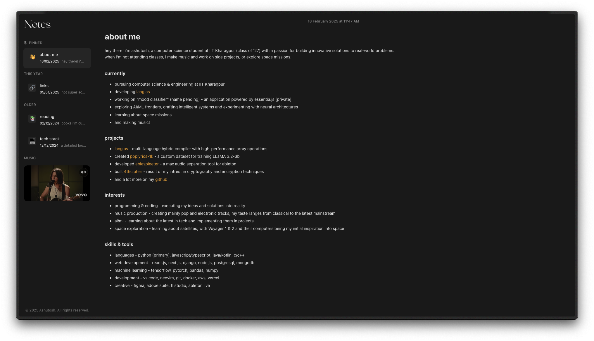

# 📝 apple notes portfolio

a minimalist portfolio website designed to look and feel like apple notes. built with react and pure css.

## ✨ features

- clean, native apple notes design
- smooth transitions and animations
- responsive layout
- dark mode by default
- inter font with variable font support
- yt music player [mute button not working]
- backend apis
- secure admin authentication
- real-time content management
- dynamic content updates
- edit the content without toching the code
- automatic cache management
- protected routes
- token-based authentication

## 🚀 pages

- about me - quick introduction and current work
- links - social media and contact info
- reading - book recommendations
- tech stack - development tools and technologies
- login - secure content management interface
- edit - edit the content without touching the code

## 🛠️ built with

- react
- mongodb
- express.js
- node.js
- axios
- jsonwebtoken
- bcrypt
- prismjs

## 🔒 security features

- JWT authentication
- protected admin routes
- secure token management
- automatic token cleanup
- encrypted passwords
- secure API endpoints

## 📄 license

MIT License,

This is a personal portfolio you can use as a template, while you're welcome to explore the code and learn from it, direct copying or reuse is not permitted. instead, use this as inspiration to create your own unique portfolio design!

© 2025 Ashutosh Sharma. All rights reserved.
